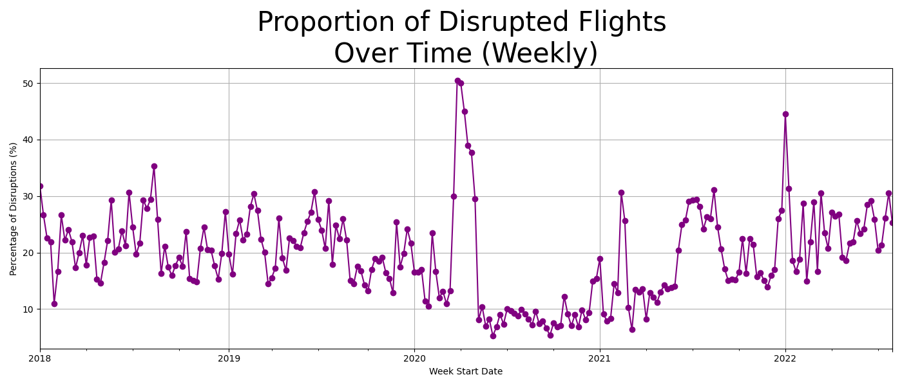
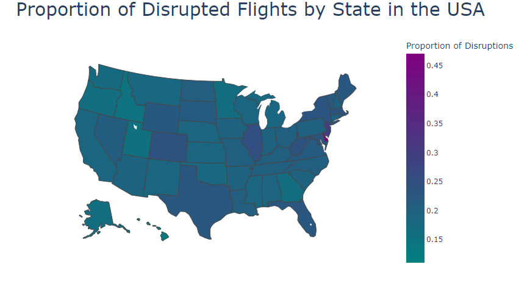

# Elevating Airline Analytics: A Comprehensive Model for Flight Disruption Prediction

University of St Andrews  
School of Computer Science

**Knowledge Discovery and Data Mining**  
ID5059 - Individual Assignment  

---

## Introduction

The purpose of this project is to develop a predictive model capable of identifying flight disruptions within the United States. To achieve this, we utilize a flight status prediction dataset posted on Kaggle by Rob Mulla.

## The Big Picture

Flight disruptions induce heavy operational costs for airlines and airports. Our model seeks to help manage this issue by providing airlines and airports with insights to plan flight schedules and allocate resources efficiently.

## Model Overview

The model predicts flight disruptions using only pre-departure information, excluding post-departure data, for reliable predictions. It is a binary classifier with two possible outcomes: disrupted and non-disrupted.

## Interesting Findings

Through thorough data exploration and numerical analysis, we found that departure cities, airlines, and airports were the most influential factors in predicting disruptions, while other factors, such as states, had less influence.

During the data processing stage, grouping locations like cities and airports by their past flight disruption rates proved to be a useful strategy. Our exploration also revealed that COVID-19 had a significant impact on disruption rates.

In a situation where we are trying to predict flight disruptions, we decided that it is more important to capture all instances of disruption, even if it means occasionally incorrectly labeling a non-disrupted flight as disrupted, rather than missing actual disruptions.

After refining each model's parameters, the Neural Network significantly outperformed the Random Forest and XGBoost models. The model's accuracy of 0.6542 shows that it correctly classifies instances better than random chance.

The model is still not accurate enough to make reliable predictions. We attribute this mainly to confounding factors that were not included in the analysis. Future efforts in this area could include adding forecasted weather, geopolitical factors, and anticipated number of scheduled flights in the variables.

## Conclusion

With the aid of machine learning, a forecasting model was developed to predict flight disruptions. While room for improvement exists, this model serves as a solid foundation for further advancement and refinement.

---

### Figures and Tables

#### Table 1: Covariates Used in Flight Disruption Prediction Model
| Covariate       | Description                                                                                               |
|-----------------|-----------------------------------------------------------------------------------------------------------|
| Disruption      | Dropped null values to avoid bias.                                                                        |
| Distance        | Imputed negative values and log-transformed due to skewness. Scaled values between 0 and 1 for the NN.   |
| OriginCityName  | Binned cities according to the proportion of disrupted flights and one-hot encoded resulting in 3 extra columns. |
| Airline         | Created a binary variable to highlight airlines with a disruption rate over 25 percent.                   |
| Month, DayOfWeek | One-hot encoded to avoid adding too many columns.                                                         |
| DepTimeBlk      | Split into morning, afternoon, evening, and night, then one-hot encoded.                                  |
| CRSArrTime      | Created 5 bins based on the proportion of disruption and then one-hot encoded.                              |
| FlightDate      | Created a binary variable for the impact of COVID on disruption rates to avoid bias.                       |

#### Table 2: Model Performance Comparison
| Metric             | RandomForest | XGBoost | Neural Network |
|--------------------|---------------|---------|----------------|
| Training Accuracy  | 0.6124        | 0.6049  | 0.6802         |
| Val Accuracy       | 0.6042        | 0.6492  | 0.6492         |
| Val Precision      | 0.6049        | 0.6429  | 0.6429         |
| Val Recall         | 0.6052        | 0.6452  | 0.6452         |
| Val F1 Score       | 0.6050        | 0.6411  | 0.6411         |

#### Table 3: Final Model Performance
| Metric              | Neural Network (Test Set) |
|---------------------|---------------------------|
| Accuracy            | 0.6542                    |
| F1 Score            | 0.6374                    |
| Recall              | 0.6583                    |
| Precision           | 0.6309                    |
| True Positive Rate  | 0.65                      |
| False Positive Rate | 0.35                      |
| True Negative Rate  | 0.65                      |
| False Negative Rate | 0.34                      |

---

## References

- Geron, A., & O'Reilly, M. (2021). Book Title.
- Fogaca, J., et al. (2022). Article Title.
- Khan, S., et al. (2021). Article Title.

